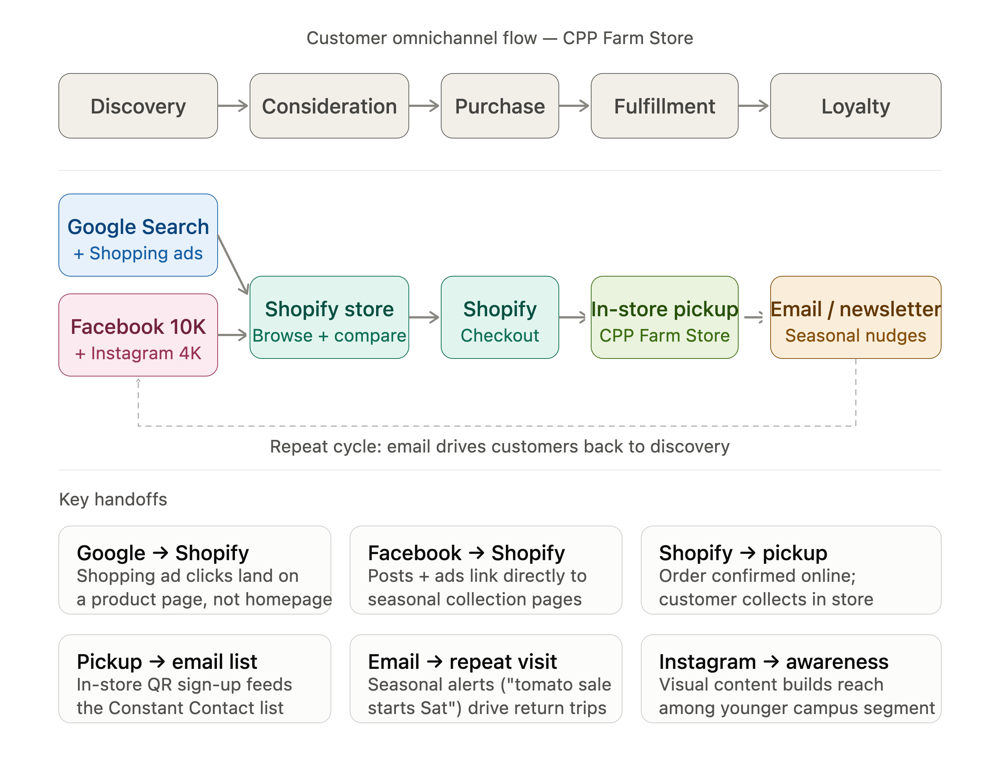

# Business problem or opportunity

The CPP Farm Store offers fresh, locally sourced, and campus grown products, but many potential customers are not fully aware of the store's products, seasonal offerings, or gift basket services. The store also has an outdated digital presence and limited online product information, making it difficult for customers to browse the items found in store, and to understand the gift basket ordering process.

The main issue the CPP Farm Store wants us to focus on is the current gift basket ordering process. This process relies heavily on manual communication, which can be inconvenient for customers while also being time consuming for the employees. These challenges create a disconnect between online product discovery and in store purchasing, leading to potential loss in revenue, and customer engagement. Overall. the biggest problems the CPP Farm Store has are the need to improve awareness and the need to digitize their ordering system which would not only include the gift baskets, but the purchasing process as a whole.

# Campaign objective

The objective of the "Fresh from Our Farm to Your Campus" campaign is to increase awareness of the CPP Farm store. The campaign will use Google Search, Google Shopping, Facebook, Instagram, email, campus partnerships, and QR-code signage to help bring awareness to the farm's seasonal products and bundles online.

The campaign will also encourage customers to place online orders for in-store pickup, which can lead to a stronger connection between digital product discovery and visits to the physical store. Over the eight week \[pilot period, success will be measured through website traffic, product-page views, click through rates (CTR), online pickup orders, social media engagement, conversion rate, and campaign revenue.

# Target audience

## Target Audience Primary Target Audience

The primary target audience for the CPP Farm Store campaign is Cal Poly Pomona students, faculty, staff, and nearby residents between the ages of 18 and 45 who value fresh, locally grown products, sustainability, and convenient shopping experiences. This audience includes both regular campus visitors and community members who are interested in supporting local agriculture while purchasing high-quality products.

Demographic Characteristics Age: 18–45 Students, faculty, staff, and nearby residents Located on or near the Cal Poly Pomona campus Budget-conscious consumers with active lifestyles Mobile-first shoppers who frequently use digital platforms Motivations

The target audience is motivated by convenience, product quality, and community involvement. They want easy access to fresh produce without spending excessive time shopping, while also supporting local farming and the university. Seasonal products, gift bundles, and campus-grown items provide additional value because they offer unique products that are not commonly found in traditional grocery stores.

## Shopping Behavior

Most customers begin their purchasing journey online by searching for products, comparing options, or viewing recommendations on social media before deciding to visit the store. They rely heavily on smartphones, Google Search, Instagram, and TikTok to discover products and promotions. Many also prefer ordering online and picking up their purchases in-store because it saves time and provides greater convenience.

## Pain Points

Several barriers currently limit customer engagement with CPP Farm Store:

Low awareness of the store among students and first-time campus visitors. Limited knowledge of store hours, location, and pickup options. Seasonal products and gift bundles are not consistently promoted online. Customers have difficulty discovering products without a strong digital presence. There is limited connection between online browsing and the in-store shopping experience. Relevant Touchpoints

Throughout the customer journey, the most influential touchpoints include:

Instagram TikTok Shopify website Google Search and Google Shopping Campus email newsletters Campus events and student organizations In-store visits and pickup experience Why This Audience Matters

This audience represents the largest and most accessible market for CPP Farm Store because they are already connected to the university and frequently visit campus. Their digital-first shopping habits make them highly responsive to integrated marketing efforts that combine social media, Google Search, and Shopify. By increasing awareness through these channels and providing a seamless transition from online discovery to in-store pickup, CPP Farm Store can attract new customers, encourage repeat visits, and build long-term loyalty within the campus community.

# Core campaign message

## Campaign Theme

Fresh from Our Farm to Your Campus

## Core Campaign Message

CPP Farm Store connects the Cal Poly Pomona community with fresh, locally grown products through a convenient omnichannel shopping experience. Customers can discover seasonal products online, explore detailed product information through the Shopify store, and easily complete their purchase with in-store pickup. The campaign emphasizes freshness, convenience, and support for local agriculture while creating a stronger connection between digital engagement and the physical store.

## Value Proposition

CPP Farm Store offers customers:

Fresh, locally grown products harvested from the university farm. A convenient online shopping experience with simple in-store pickup. Seasonal produce and unique gift options that reflect the local community. An opportunity to support Cal Poly Pomona agriculture and sustainable farming initiatives. A seamless omnichannel experience that connects online product discovery with in-store purchasing.

# Channel strategy

CPP Farm Store's campaign uses a *six-channel omnichannel strategy* designed to meet customers where they already are and guide them toward in-store pickup as the primary conversion point.

**Google Search** and **Google Shopping** serve as the top-of-funnel discovery layer, capturing high-intent searches for local produce, gift baskets, and campus products. A well-configured product feed in Google Merchant Center ensures CPP Farm Store appears when nearby shoppers are actively looking for what the store carries.

**Facebook and Instagram** handle awareness and engagement for audiences who are not yet actively searching. With 10K followers on Facebook and 4K on Instagram, Facebook is the stronger existing broadcast channel for reaching the broader local community, while Instagram targets the younger campus segment through visual content. Both platforms drive traffic to the Shopify store.

**Shopify** functions as the central hub — the single destination that all other channels point to. It is where customers browse products, learn about gift basket options, and place pickup orders, replacing the current analog ordering workflow with a digitized, self-serve experience.

**Email and newsletter** serve the mid-to-lower funnel, keeping existing customers informed of seasonal availability, promotions, and gift basket options. The existing *in-store QR code sign-up* feeds this list directly, connecting the physical store to the digital channel.

The **physical store** remains the *fulfillment endpoint for all channels*. In-store pickup is the primary conversion mechanism, meaning every digital channel ultimately drives customers back through the door.

# Omnichannel flow

The flow above illustrates how a customer moves through CPP Farm Store's six channels across five journey stages. A customer first discovers the store through Google Search, a Facebook post, or an Instagram visual. From there, both Google Shopping ads and social media links direct them to the Shopify store, where they can browse products, explore gift basket options, and place a pickup order. The physical store is the fulfillment endpoint: every digital channel converges here.

After pickup, the in-store QR code feeds customers into the Constant Contact email list, which then closes the loop by sending seasonal availability alerts that bring customers back to the top of the funnel.

The six key handoffs at the bottom of the diagram show exactly where each channel transition happens and what it needs to do to keep the customer moving forward.

# Campaign tactics

The campaign will use an eight-week pilot program built around the theme **“Fresh from Our Farm to Your Campus.”** Each tactic is designed to move customers from awareness to online product discovery, in-store pickup, and future repeat purchases.

| Campaign tactic | Channel | Execution | Role in the customer journey |
|------------------|------------------|------------------|------------------|
| **“Fresh This Week” landing page** | Shopify | Create a dedicated landing page featuring current seasonal products, product availability, store hours, location, and pickup instructions. The page should be updated weekly and linked from all campaign channels. | Gives customers one clear destination to browse products and prepare for a store visit or pickup order. |
| **Seasonal pickup bundles** | Shopify and physical store | Offer a rotating seasonal produce bundle and a CPP Farm Store gift bundle. Bundles should include clear product descriptions, pricing, estimated pickup time, and product images. | Makes shopping easier for customers who want convenience or need a ready-made gift option. |
| **“Fresh This Week” social media series** | Facebook and Instagram | Publish two to three posts per week featuring newly available products, behind-the-scenes farm content, bundle promotions, customer favorites, and pickup reminders. Instagram Stories can also be used for product availability updates and polls. | Builds awareness and gives customers a reason to regularly check what is available. |
| **Paid social advertisements** | Facebook and Instagram | Run geographically targeted advertisements aimed at CPP students, employees, alumni, and nearby residents. Advertisements should use product images, short videos, and messages emphasizing freshness, convenience, and support for CPP agriculture. | Introduces the store to customers who may not currently follow its social media accounts. |
| **Google Search campaign** | Google Search | Use search advertisements for phrases such as “fresh produce near Cal Poly Pomona,” “local produce Pomona,” “CPP Farm Store hours,” and “gift baskets near me.” Advertisements should link directly to the Shopify landing page. | Reaches customers who are already searching for local produce, store information, or gift options. |
| **Google Shopping listings** | Google Merchant Center and Google Shopping | Submit accurate product titles, prices, images, availability, and pickup information through the product feed. Seasonal products should be updated regularly so customers do not see unavailable items. | Helps high-intent customers discover specific products before visiting the store. |
| **Email announcement series** | Constant Contact | Send an initial campaign announcement followed by weekly or biweekly emails highlighting seasonal availability, featured bundles, store information, and pickup instructions. | Encourages existing customers to return and keeps the store visible throughout the campaign. |
| **Campus and in-store QR signage** | Physical store and campus signage | Place signs in high-traffic campus areas and inside the Farm Store. Each sign should include a QR code linking to the “Fresh This Week” page or email sign-up form. | Connects the physical campus environment to the Shopify store and email list. |
| **Campus partner promotion** | Student organizations and university departments | Provide ready-to-share campaign graphics to student organizations, campus departments, and university social media accounts. Partners can repost seasonal promotions and pickup information at no additional advertising cost. | Expands organic reach through trusted campus communication channels. |
| **Post-purchase retention tactic** | Physical store and email | Include a small card or receipt message encouraging pickup customers to join the email list, follow the store on social media, and check the weekly product page. | Turns one-time visitors into repeat customers and closes the omnichannel campaign loop. |

## Campaign Promotion Schedule

During the first two weeks, the campaign should focus on awareness by introducing the campaign theme, Shopify landing page, store location, and pickup process. During weeks three through six, content should emphasize seasonal bundles, specific products, customer benefits, and reminders to place pickup orders. During the final two weeks, the campaign should promote urgency by highlighting limited seasonal availability and encouraging customers to subscribe for future product announcements.

The product bundles and featured items should change based on inventory and seasonal availability. This prevents the campaign from promoting unavailable products and gives customers a reason to return to the website throughout the campaign.

# Budget recommendation

CPP Farm Store should begin with a hypothetical **\$3,000 budget for an eight-week pilot campaign**. The budget prioritizes Google and social media advertising because these channels can generate measurable website traffic and reach customers both on and near campus. The remaining budget supports the Shopify experience, campaign content, email communication, and physical signage.

| Budget category | Amount | Percentage | Reason for allocation |
|------------------|------------------:|------------------:|------------------|
| Google Search and Shopping Ads | \$1,050 | 35% | Google reaches customers who are actively searching for local produce, gift baskets, store information, and nearby shopping options. |
| Facebook and Instagram advertising | \$750 | 25% | Paid social media increases awareness among students, faculty, staff, alumni, and nearby residents who may not currently follow the store. |
| Content and creative production | \$300 | 10% | Supports product photography, short-form videos, social media graphics, advertisement designs, and email visuals. |
| Campus and in-store signage | \$300 | 10% | Pays for printed posters, pickup signs, table displays, and QR-code materials that connect campus traffic to the Shopify website. |
| Shopify landing page and campaign tracking | \$250 | 8.3% | Supports landing-page improvements, QR-code creation, campaign links, and basic tracking setup. |
| Email marketing | \$150 | 5% | Supports email design, list management, campaign announcements, and seasonal product updates. |
| Testing and contingency fund | \$200 | 6.7% | Allows the store to increase spending on high-performing advertisements or respond to unexpected campaign needs. |
| **Total** | **\$3,000** | **100%** |  |

## Paid and Organic Tactics

Approximately **60% of the budget** is allocated to paid Google, Facebook, and Instagram promotion. These channels are the campaign’s primary tools for reaching new customers and generating traffic to the Shopify store.

Organic tactics include regular Facebook and Instagram posts, Shopify product updates, emails to the existing customer list, campus partner reposts, and in-store promotion. These tactics require employee time but allow CPP Farm Store to extend the campaign without significantly increasing advertising costs.

## Budget Priorities

The first priority should be Google Search and Shopping because these channels reach customers with strong purchasing intent. Facebook and Instagram should be the second priority because they can build awareness and visually promote seasonal products and gift bundles.

CPP Farm Store should not spend the entire advertising budget at the beginning of the campaign. The initial budget should be distributed evenly across the first two weeks while performance data is collected. After identifying the advertisements, products, and channels generating the most website visits, pickup orders, and revenue, the store should move part of the contingency budget toward the strongest-performing areas.

Because this is a pilot campaign, the recommended budget is intentionally limited and measurable. The results can help CPP Farm Store determine whether a larger seasonal campaign would be financially worthwhile in the future.

# KPIs

## Key Performance Indicators

To measure the success of the CPP Farm Store campaign, the following key performance indicators (KPIs) will be tracked throughout the campaign period. These metrics align with the campaign objective of increasing awareness, driving online engagement, and encouraging in-store purchases.

### Website Traffic

Monitor the number of visitors to the Shopify store to evaluate whether digital marketing efforts are successfully increasing awareness of the CPP Farm Store.

### Product Page Views

Track views on seasonal products, gift bundles, and featured farm products to understand which items generate the greatest customer interest.

### Click-Through Rate (CTR)

Measure the percentage of users who click on advertisements, social media posts, emails, and Google Shopping listings to determine the effectiveness of campaign messaging and creative content.

### Conversion Rate

Track the percentage of website visitors who complete a purchase or place an online pickup order. This metric evaluates how well the website converts interest into sales.

### In-Store Pickup Orders

Measure the number of online orders selected for in-store pickup to determine whether the campaign successfully connects the online shopping experience with physical store visits.

### Social Media Engagement

Monitor likes, comments, shares, saves, and video views across Instagram and TikTok to evaluate audience interaction and brand awareness.

### Campaign Revenue

Measure total revenue generated during the campaign and compare it with previous sales periods to determine the campaign's overall financial impact.

# Optimization plan

## Campaign Optimization Strategy

Following the campaign launch, CPP Farm Store should continuously monitor campaign performance and make data-driven improvements based on customer behavior and campaign results.

The marketing team should regularly compare different ad creatives, headlines, and product images through A/B testing to determine which messages generate the highest click-through and conversion rates. Product titles and descriptions should also be updated based on search trends and customer engagement to improve product discoverability.

Campaign budgets should be adjusted throughout the campaign by allocating more spending toward the highest-performing channels, such as Instagram, Google Shopping, or email marketing, while reducing investment in lower-performing advertisements.

The team should also monitor best-selling seasonal products and update the Shopify homepage, featured collections, and product feed to highlight items with the greatest demand. Landing pages should be reviewed regularly to improve page speed, simplify navigation, and make the checkout process as seamless as possible.

Finally, customer purchasing patterns and seasonal demand should be analyzed throughout the campaign to identify future promotional opportunities, optimize inventory planning, and improve future omnichannel marketing campaigns.

# Appendix

- [GitHub Repo](https://github.com/lewiswaddell/GP4.git)

- [GitHub Page](https://lewiswaddell.github.io/GP4/)
